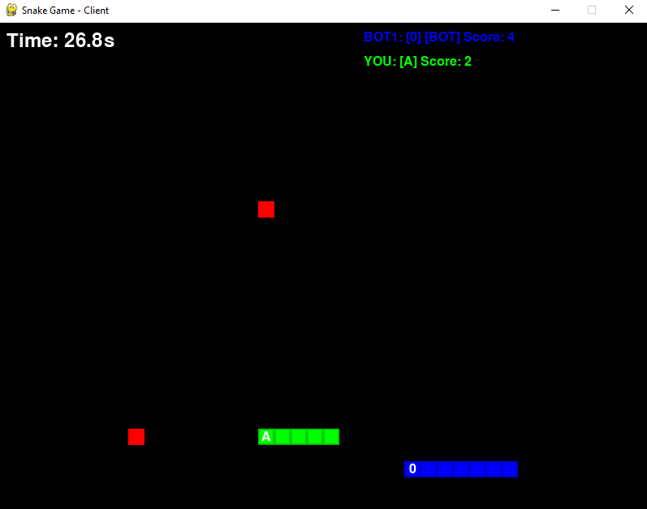

# Snake Game - Multiplayer Client-Server

## 1. Introduction

This is an **educational project** demonstrating a multiplayer snake game implemented with a client-server architecture using Python. The project showcases:

- **Network programming** with sockets and JSON communication
- **Game development** using pygame-ce (Community Edition)
- **Multi-threading** for concurrent client handling
- **Real-time multiplayer** gameplay with multiple players and bots
- **Object-oriented programming** with game state management

The game supports multiple human players connecting to a central server, each controlling their own snake with a unique color and letter identifier. Players compete to collect food and grow their snakes while avoiding collisions with walls, themselves, and other players.

The server automatically advertises itself via UDP broadcast, allowing clients to discover and connect without needing to know the server's IP address in advance.

## 2. Game Screenshot



## 3. Command Line Options

### Server Options

The server (`snake_server.py`) supports the following command line arguments:

- `--bots <number>` - Number of bot players to add (default: 0)
- `--bot-level <0-9>` - Bot difficulty level (default: 5)
  - `0` = Most random behavior
  - `9` = Direct movement towards food
- `--host <address>` - Server host address (default: `0.0.0.0` - all interfaces)
- `--port <number>` - Server port number (default: 5555)
- `--game-speed <float>` - Game speed multiplier (default: 1.0)
  - `1.0` = Default speed (0.5x of original speed)
  - `2.0` = 2x slower
  - `0.5` = 2x faster

**Examples:**
```bash
# Start server with default settings
python snake_server.py

# Start server with 3 bots at difficulty level 7
python snake_server.py --bots 3 --bot-level 7

# Start server on port 5555 (default) with slower game speed
python snake_server.py --port 5555 --game-speed 2.0
```

### Client Options

The client (`snake.py`) supports the following command line arguments:

- `--host <address>` - Server host address (if not specified, client will auto-discover server via UDP)
- `--port <number>` - Server port number (must be specified together with --host, or omitted for auto-discovery)

**Note:** If you don't specify `--host` and `--port`, the client will automatically search for servers on the local network using UDP broadcast discovery.

**Examples:**
```bash
# Auto-discover server via UDP (recommended for local network)
python snake.py

# Connect to a specific server
python snake.py --host localhost --port 5555

# Connect to a server on another machine
python snake.py --host 192.168.1.100 --port 5555
```

**Controls:**
- **Arrow Keys** - Move your snake (UP, DOWN, LEFT, RIGHT)
- **SPACE** - Restart after dying
- **R** - Restart entire game (only available if you're the last human player alive)
- **ESC** - Quit the game

## 4. Installation and Running

### Clone the Repository

```bash
git clone https://github.com/mavstuff/snake.git
cd snake
```

### Install Dependencies

Make sure you have Python 3.7 or higher installed, then install the required dependencies:

```bash
pip install -r requirements.txt
```

This will install:
- `pygame-ce` - Community Edition of pygame for game graphics and input handling

### Run the Game

1. **Start the server** (in one terminal):
   ```bash
   python snake_server.py
   ```

2. **Start one or more clients** (in separate terminals):
   ```bash
   python snake.py
   ```

3. **Select your letter** when prompted (A-Z), then use arrow keys to play!

### Example: Running with Bots

To practice against bots before other players join:

```bash
# Terminal 1: Start server with 2 bots
python snake_server.py --bots 2 --bot-level 6

# Terminal 2: Start your client
python snake.py
```

The bots will automatically start when the first human player connects.

---

**Enjoy playing!** 🐍

